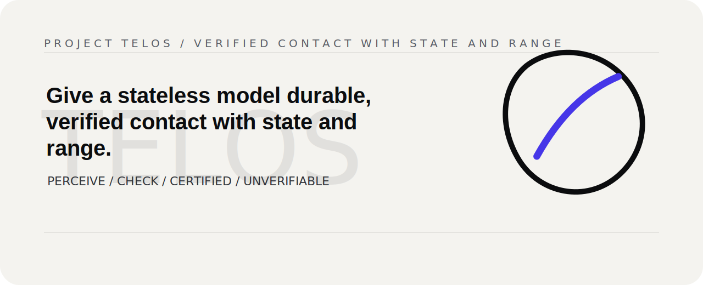

<p align="center">
  
</p>
<!-- Project mark: docs/brand/telos-mark.svg -->

# Project Telos

> Give a stateless model durable, verified contact with state and range.

[Project Telos](https://harperz9.github.io) | [Gather](https://github.com/HarperZ9/gather) | [Crucible](https://github.com/HarperZ9/crucible) | [Index](https://github.com/HarperZ9/index) | [Forum](https://github.com/HarperZ9/forum) | [Telos](https://github.com/HarperZ9/telos)


## Try it

Zero dependencies, Node 18 or newer.

```bash
git clone https://github.com/HarperZ9/telos.git
cd telos
node demo/run.mjs
node demo/catalog.mjs --summary
node demo/server-manifest.mjs --summary
```

Open the visual certificate-loop surface at [`demo/index.html`](demo/index.html).
Use `node demo/catalog.mjs --summary` for a compact operator map of the CLI and MCP surface.
Use `node demo/server-manifest.mjs --summary` for the five-server MCP launch map.

## Why it matters

The hard part of AI work is not producing an answer. It is keeping state,
perception, action, and verification in the same room long enough for a human or
another system to re-check what happened. Telos is the shared work surface for
that: a way to let a model propose without letting confidence become the proof.

## Work with it

Bring a workflow where the record matters: research intake, editorial claims, agent
routing, clinical-adjacent review, design pipelines, due diligence, or any loop where
an honest UNVERIFIABLE is worth more than a polished guess. The useful next step is
pressure from real operators, verifier feedback, and research support for the memory,
perception, and action floor.

## Current status

- **Release:** source demo; command surface is `node demo/run.mjs`, `node demo/room.mjs`, `node demo/status.mjs`, `node demo/doctor.mjs`, `node demo/catalog.mjs`, `node demo/server-manifest.mjs`, `node demo/admission-telemetry.mjs`, and `node demo/flagship-workflow.mjs`.
- **Operator surface:** `node demo/telos-mcp.mjs` exposes native MCP tools: `telos.status`, `telos.doctor`, `telos.room`, `telos.catalog`, `telos.workflow`, `telos.server.manifest`, `telos.admission.telemetry`, and `telos.showcase.scout`.
- **Current floor:** the operator room reconciles 26 available tools across Gather, Crucible, Index, Forum, and Telos, with a provider-neutral catalog and server manifest for CLI, MCP, plugin, IDE, TUI, and app hosts. See [CHANGELOG.md](CHANGELOG.md).
- **Proof lane:** `node demo/showcase.mjs scout --fixture` starts the OSS Proof Showcase, a local-first path from public issue evidence to PR-readiness packets.
- **Learning Forge intake:** `demo/research/youtube-learning-forge-receipts.json` records the latest video/channel research seed as receipt-only material for later Index, Forum, Crucible, and Telos lab conversion.

## What it is

A language model is brilliant and forgetful in the same breath. It can reason its way through a hard problem inside one window of text, then lose the thread the moment the answer depends on something it cannot see. What changed. What is true right now. What it itself did a minute ago. It does not know, and worse, it does not know that it does not know. The confidence stays high while the accuracy quietly falls away.

Project Telos is the work of giving a model the footing it is missing: a durable memory it can read instead of guess at, real senses pointed at the world, a way to act with the brakes wired in, and underneath all of it, a way to check its own work before you are asked to trust it.

## What goes wrong without it

A transformer is a function over a window of tokens. It has no live memory of state, no values it can look up, no record of the order things happened in. So it is steady on self-contained logic and blind on everything else: long-running state, and the quiet bounds that hold a system together. A depth that has to stay between zero and one. A count that cannot go negative. A buffer that did not overflow.

The expensive failure is not that the model is sometimes wrong. Everything is sometimes wrong. The failure is that its confidence does not fall when its accuracy does. A confident mistake reads exactly like a confident truth, and you find out which was which downstream, if you ever find out at all.

## The shape of the fix

You cannot train the overconfidence out of a model, so Telos does not try. It builds the missing organs around the model instead.

- A **memory** it reads from rather than recalls. An addressable store, not a fading impression.
- **Perception** that turns ground truth into bytes and pins where those bytes came from.
- **Action with impedance**, where an effect is checked against the rules before it is allowed to land.
- **A clock**, so every fact carries the time it was true.

Put together, these form a membrane between a stateless mind and a changing world. Nothing reaches the model as fact unless the store witnessed it. Nothing leaves the model as an effect unless the rules allow it. You do not verify the model, because you cannot. You verify the membrane.

## The part you can run

The trust in all of this rests on one small loop, and it is small on purpose.

```
perceive an artifact,
then recover the invariant that has to hold,
then check it against a criterion the model did not author,
then return one of three answers: MATCH, DRIFT, or UNVERIFIABLE.
```

There is no fourth answer, and there is deliberately no TRUSTED. When the loop cannot verify something, it says UNVERIFIABLE and stops, rather than hand back a guess wearing the costume of an answer. The certificate it produces re-checks from its own evidence, so you believe it by re-running it, not because it told you to.

## Run it

Zero dependencies, Node 18 or newer.

```
node demo/run.mjs
```

It renders a four-dimensional cube, perceives it two independent ways, checks what it recovered against the true count of vertices and edges, and prints a certified result that re-checks. Then it does the more important thing. It feeds the loop a render too small and broken to read, and shows it returning UNVERIFIABLE instead of a confident pass. A verifier that cannot fail is not a verifier, and this one fails honestly.

```
RUN A   an honest 4-D cube render        ->  CERTIFIED      recheck = true
   criterion : 16 vertices, 32 edges         (the external truth the loop did not author)
   recovered : 16 vertices, 32 edges         (exact match)

RUN B   a render too small to read (8x8) ->  UNVERIFIABLE   recheck = true
   the two perceptions cannot agree, so the loop refuses to certify.
   it reports UNVERIFIABLE rather than lean on the reading that happens to be right.
```

## Try it in the field

The fastest test is to bring Telos a workflow where a model answer is not enough; a person needs to see what happened and re-check it later.

- **Doctor / clinical admin:** source fragments, routing decisions, and uncertainty stay visible before a summary or recommendation becomes action.
- **Artist / studio:** prompts, source assets, transforms, chosen branches, and export gates stay attached to the finished artifact.
- **Media / newsroom:** public claims map back to witnessed sources, conflict notes, and an editorial decision ledger.
- **Token economy / routing:** model calls are spent where they buy evidence, coverage, or verification, not where they merely produce confident prose.
- **Reasoning:** the model can perceive and propose; final authority belongs outside the model, in a checkable record a person can inspect.

Main site: <https://harperz9.github.io>. GitHub: <https://github.com/HarperZ9>. Flagship repos: [Gather](https://github.com/HarperZ9/gather), [Crucible](https://github.com/HarperZ9/crucible), [Index](https://github.com/HarperZ9/index), [Forum](https://github.com/HarperZ9/forum), and [the Telos engine](https://github.com/HarperZ9/telos).

I am looking for verification, testing against real workflows, early traction from people willing to inspect receipts, and possibly modest grassroots research funding or pointers.

## Why AlphaZero is the right comparison

This shape is not new, and the clearest proof of that is AlphaZero. A single neural network sits at its center, a stateless prior that guesses good moves and guesses who is winning. On its own it plays well and no better. What makes it superhuman is the search bolted on beside it, an outside process you can re-run that tests the network's guess against the actual rules of the game before it commits to a move. The network proposes. The search verifies.

Line the pieces up and Telos is the same machine, pointed at work that is not a game. The network's guess is the model's cheap output. The search is the reconcile loop. The rules of the game are the external criterion. And the way AlphaZero takes risk in proportion to what the search has actually checked is the way Telos extends trust in proportion to what re-derives.

Prof. Mihai Nica walks through this plainly in his AlphaZero Explained series, where the search is shown as a kind of visible thinking budget you can look inside, and the whole method comes down to, in David Silver's words, "three steps and literally nothing else." The plainness is the point. It is a small, legible loop, not a mystery.

## Who it is for

- People handing real work to AI agents who want a receipt for it. What changed, checked before and after, and re-checkable later, instead of trust by reputation.
- People building agent loops who want the checking step grounded in something outside the model. Self-critique with no outside standard just agrees with itself.
- Anyone who would rather hear an honest "I cannot verify this" than a confident answer that turns out to be invented.

## The bricks

The flagship is the mission. These open pieces are the bricks it is built from, and you can pick any of them up on its own. The counts come from running the test suites, not from memory.

- **[coherence-membrane](https://github.com/HarperZ9/coherence-membrane)** turns a render or a frame into MATCH, DRIFT, or UNVERIFIABLE. Zero dependencies. 900 tests.
- **[accountable-surface](https://github.com/HarperZ9/accountable-surface)** is the full loop of perceive, gate, and act. 201 tests.
- **[EMET](https://github.com/HarperZ9/emet)** is an outside witness built on a perceptual hash and a content hash, with the same answer reproduced in two independent languages. 41 tests.
- **[reconcile](https://github.com/HarperZ9/reconcile)** is the bare primitive, with worked examples for novelty and structural fitness. 21 tests.
- **[studio-engine](https://github.com/HarperZ9/studio-engine)** generates structures to perceive, behind a small REST API. 122 tests.
- The **engine** the demo runs on, which renders and perceives and reconciles, is 162 tests and zero dependencies. It is kept local for now while the five above are public.

These are open and tested on GitHub. They are not yet packaged for pip or npm.

For the full picture, read [how it works](docs/HOW-IT-WORKS.md), [the architecture](docs/ARCHITECTURE.md), and [who uses it](docs/WHO-USES-IT.md).

## What it does not claim

This is early, and it earns trust by being clear about where it stops.

- The membrane decides what the model sees, not what it believes. A strong prior from training can still talk over a quietly staged fact, which is why the seal is placed on the way out, at the point of action, and not only on the way in.
- Passing every check means tripping no named failure, which is not the same as being correct. Coverage grows one caught bug at a time. The overconfidence is reduced, never erased.
- It works on a world you can pause and replay. It is a body for recorded, steppable state, not for real time control.
- A verifier you have not verified is worse than none, because it lends a falsehood the authority of ground truth. The whole value sits in the word verified.

## Why it exists

In the author's own words, from a public comment.

> "building honest tools that keep my ADHD in check, an accountable research harness, an ecosystem of tools to help hold my work, and a model's work, to an accurate standard when my brain gets lost. The mission is to give a stateless LLM durable, verified contact with state and range."

## License

Project Telos is fair-source. The code is open to read and to run, free for nearly any use except building a competing product, and it converts to a fully open license two years after each release. The smaller bricks above are permissively open already. The aim is plain: keep the work in the open and in the hands of the people using it, while keeping the flagship able to fund the research it came from. Copyright is held by the author.

## For developers

Keep the public README, examples, and repository metadata aligned with current behavior. Before opening a PR or publishing a release, verify the working tree and any documented commands for this repo.

```bash
git status --short
```
