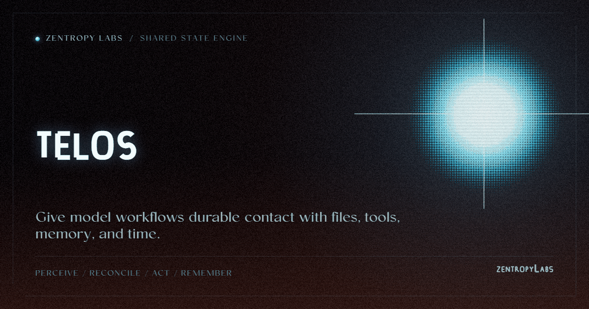

<p align="center"></p>

**The shared workbench: durable state, native workstation control, sensory organs, a discovery forge.**


[](https://github.com/HarperZ9/telos/actions/workflows/ci.yml)


Telos is a zero-dependency local workbench for creating, simulating, and replaying AI work. It ships a five-server MCP surface plus CLI fallbacks: doctors for CI, presentation, accessibility, performance, and compatibility, a creative engine with deterministic kernels and ten measurement meters, model-foundry and learning-forge lanes, and research proof packets spanning causal, embodied, and quantum demos. It ties gather, index, forum, and crucible into one operator map you can run with a single `node demo/run.mjs`. Every run writes a receipt you can re-check.

[Project Telos](https://harperz9.github.io) | [gather](https://github.com/HarperZ9/gather) | [crucible](https://github.com/HarperZ9/crucible) | [index](https://github.com/HarperZ9/index) | [forum](https://github.com/HarperZ9/forum) | [telos](https://github.com/HarperZ9/telos) | [learn](https://github.com/HarperZ9/learn) | [emet](https://github.com/HarperZ9/emet) | [buildlang](https://github.com/HarperZ9/buildlang)

## What it does

- **One MCP surface over five flagships.** `node demo/telos-mcp.mjs` (or `npm start`) runs a stdio MCP server exposing 41 native `telos.*` tools, and the server manifest launches gather, index, forum, and crucible beside it: 69 tools total plus 29 declared auxiliary compatibility tools, with ready-to-paste host config for Codex (TOML), Claude (JSON), and OpenAI Agents.
- **Four proof lanes through one CLI.** `node demo/proof.mjs` assembles agent-action, research-claim, visual-truth, and build proof packets. Each has a pure verifier that recomputes every load-bearing claim from materials embedded in the packet, so a canned pass is structurally impossible, and `node demo/proof.mjs verify <packet.json>` replays any of them by schema id.
- **Nine doctors.** CI doctor and CI triage read GitHub Actions state and separate fatal failures from runtime migration warnings. Presentation, accessibility, performance, compatibility, and operator doctors audit README parity, static a11y, byte budgets, protocol coverage, and discoverability. All run offline against local checkouts.
- **A creative engine you can measure.** Deterministic kernels (ordered dither, pixel sort, harmonograph, clustered light), a WebGPU/WebGL/canvas/static renderer selection contract, and ten runnable meters across histogram, dither, splat, cluster, audio, flicker, curvature, interaction, uncertainty, and frame-budget signals. The visual surface lives at [`demo/index.html`](demo/index.html).
- **Research proof packets.** Deterministic preflights for causal inference (toy-DAG minimal adjustment set), embodied sim-to-real (differential drive with safety envelope and latency bound), and quantum error correction (3-qubit bit-flip stabilizer code), each with negative controls and explicit non-claims.
- **Model foundry and learning forge.** A bounded contract for routing work across hosted frontier APIs and local open-weight models, seven executable lab contracts with failure cases and metrics, and a self-improving daemon loop that only promotes verified changes.
- **Context tooling for large codebases.** Budgeted, validated context packs and envelopes for handing a big workspace to a model without losing provenance.
- **Native workstation control.** `node demo/native-control.mjs` drives the browser via the Chrome DevTools Protocol and native apps via Windows UI Automation, delivering synthetic events so the operator's cursor and keyboard stay free; the MCP tool `telos.native.control` is the read-only capability catalog, and browser-evidence packets make automated browsing reviewable.

## Try it

Zero runtime dependencies. Node 20 or newer; CI runs on Node 24.

```bash
git clone https://github.com/HarperZ9/telos.git
cd telos
node demo/run.mjs
```

`demo/run.mjs` renders a 4-D cube, perceives it through independent channels, checks the recovered vertex and edge counts against the true criterion, and prints a certificate that re-checks from its own evidence. Then it feeds the loop a render too small to read and shows it returning UNVERIFIABLE instead of a confident pass. A verifier that cannot fail is not a verifier.

From there, the two orientation commands:

```bash
node demo/catalog.mjs --summary          # operator map: 69 tools across 5 flagships
node demo/server-manifest.mjs --summary  # 5-server MCP launch map with host config
```

Expected catalog summary:

```
Project Telos MCP Catalog
tools    69 total, 69 available
transport stdio, streamable-http
gather    5 tools ...
index     5 tools ...
forum     5 tools ...
crucible  13 tools ...
telos     41 tools ...
```

To run the MCP server for a host: `npm start` (stdio). Health and state:

```bash
node demo/status.mjs --summary
node demo/doctor.mjs --summary
node demo/room.mjs --json
```

Every command emits a `project-telos.flagship-action/v1` envelope with a MATCH, DRIFT, or UNVERIFIABLE status. The package also ships `telos` and `telos-mcp` bin entries that route to the same demo surface.

## Worked example: a proof packet that can fail

Assemble the demo agent-action proof packet, then replay its verification from the packet alone:

```bash
node demo/proof.mjs agent-action --demo --json > packet.json
node demo/proof.mjs verify packet.json
```

Expected output:

```
verdict       MATCH
witness       witnessed / MATCH
```

The packet joins source refs, context refs, route, admission decision, side effects, and output digests. The verifier recomputes digests from the embedded materials, so editing any load-bearing field flips the verdict to DRIFT, and a missing recomputable basis is reported as UNVERIFIABLE with the gap named by path. The sibling lanes work the same way: `research` recomputes source and negative-control digests and refuses reproduction-gated promotion in a single packet, `visual` recomputes color and luminance from embedded sRGB samples, and `build` recomputes a conserved-quantity invariant against a negative fixture that must break it. The delivery ledger is [docs/PROOF-LANES.md](docs/PROOF-LANES.md).

## Command surface

`node demo/catalog.mjs` is the authoritative map. Highlights by area:

| Area | Commands |
| --- | --- |
| Orientation | `run.mjs`, `catalog.mjs`, `server-manifest.mjs`, `status.mjs`, `doctor.mjs`, `room.mjs` |
| Doctors | `ci-doctor.mjs`, `ci-triage.mjs`, `presentation-doctor.mjs`, `accessibility-doctor.mjs`, `performance-doctor.mjs`, `compatibility-doctor.mjs`, `operator-doctor.mjs`, `mcp-freshness.mjs` |
| Proof | `proof.mjs` (agent-action, research, visual, build, verify, export), `showcase.mjs` |
| Context | `context-envelope.mjs`, `context-pack.mjs`, `action-receipt.mjs`, `loop-ledger.mjs` |
| Creative | `creative-engine.mjs`, `creative-kernels.mjs`, `measurement-layers.mjs`, `rendering-capabilities.mjs`, `display-calibration.mjs` |
| Research | `causal-workbench-proof-packet.mjs`, `embodied-sim2real-proof-packet.mjs`, `quantum-error-correction-proof-packet.mjs`, `thermodynamic-ai-chip-receipt.mjs` |
| Foundry | `model-foundry.mjs`, `learning-forge.mjs`, `learning-forge-labs.mjs` |
| Workstation | `native-control.mjs`, `browser-evidence.mjs`, `workstation-substrate.mjs`, `revival-registry.mjs`, `second-level-flagship-queue.mjs` |

Most accept `--summary` for a compact terminal (TUI) view and `--json` for IDE, app, and automation hosts.

The doctor lanes in full: `node demo/ci-doctor.mjs`, `node demo/presentation-doctor.mjs`, `node demo/accessibility-doctor.mjs`, `node demo/performance-doctor.mjs`, `node demo/compatibility-doctor.mjs`, and `node demo/operator-doctor.mjs`, plus `node demo/ci-triage.mjs` and `node demo/mcp-freshness.mjs`. Live CI intake works read-only: `node demo/ci-triage.mjs --gh-run owner/repo#run_id --summary`.

## Documentation

- [docs/INTRODUCTION.md](docs/INTRODUCTION.md): what Telos is and your first ten minutes.
- [docs/HOW-IT-WORKS.md](docs/HOW-IT-WORKS.md): the verifier loop, step by step, including where it stops.
- [docs/ARCHITECTURE.md](docs/ARCHITECTURE.md) and [docs/PROJECT-CONNECTION-MAP.md](docs/PROJECT-CONNECTION-MAP.md): system shape and how the five flagships connect.
- [docs/PROOF-LANES.md](docs/PROOF-LANES.md): the proof-lane contracts and delivery ledger.
- [docs/CURRENT-STATE.md](docs/CURRENT-STATE.md): the live evidence-first state packet.
- [USAGE.md](USAGE.md): install, run, MCP, and verify commands.

Peer repos: [gather](https://github.com/HarperZ9/gather) (research intake), [index](https://github.com/HarperZ9/index) (workspace maps and context), [forum](https://github.com/HarperZ9/forum) (agent routing with a causal ledger), [crucible](https://github.com/HarperZ9/crucible) (claim verification), [emet](https://github.com/HarperZ9/emet) (independent coherence witness). Telos launches and reconciles all five from one manifest; each also stands alone.

## Status and maturity

This is a 0.2.0 source-registry package. The command surface above is tested and CI-covered (the repo carries over 60 test files run individually in CI), but npm publishing is operator-gated and interfaces may still move between minor versions. Research packets are deterministic preflights with explicit non-claims: the causal packet does not claim causal discovery, the embodied packet does not claim real-robot safety, the quantum packet does not claim hardware QEC. Treat the receipts and tests in this repo as the evidence, not prose counts.

The active consolidation roadmap is [`docs/PROJECT-TELOS-LARGE-SCALE-ROADMAP-2026-07-02.md`](docs/PROJECT-TELOS-LARGE-SCALE-ROADMAP-2026-07-02.md), and the documentation control plane is [`docs/DOCUMENTATION-CONSOLIDATION-REGISTRY-2026-07-02.md`](docs/DOCUMENTATION-CONSOLIDATION-REGISTRY-2026-07-02.md) with the machine-readable registry under [`docs/registry/`](docs/registry/).

## The receipt underneath

One idea runs under everything here: an action or claim only counts when it carries evidence a person or another system can re-check later, and when the check cannot pass, the answer is an honest UNVERIFIABLE rather than a confident guess. That is why every command writes a receipt and every proof verifier is built to be able to fail.

## License

FSL-1.1-ALv2 (fair source). The code is open to read and run, free for nearly any use except building a competing product, and each release converts to Apache 2.0 after two years. Copyright is held by the author. See [LICENSE](LICENSE).

## For developers

Zero dependencies, so there is nothing to install. Run the MCP contract tests and smoke checks before opening a PR:

```bash
npm run test:mcp
node demo/catalog.mjs --summary
node demo/server-manifest.mjs --summary
node demo/room.mjs --json
```

CI (`.github/workflows/ci.yml`) runs each contract test file individually on Node 24; run any of them directly with `node demo/<name>.test.mjs`. Keep the README, package metadata, and examples aligned with current behavior; `node demo/operator-doctor.mjs --summary` checks that parity.

## What this believes

This tool is one lane of a family that holds a single belief steady across
every surface: knowledge open to anyone who can attain the means; acceptance
decided by external checks, never reputation; every result re-runnable;
honest nulls first-class; ownership earned by comprehension; learning woven
into the work. The full text lives in [CREDO.md](CREDO.md).

The long form of this belief: [The Unbundling](https://github.com/HarperZ9/flywheel/blob/fix/release-model-identity/docs/essays/2026-07-13-the-unbundling.md).

---

**[Zentropy Labs](https://github.com/ZentropyLabs-ai)** · order out of entropy. An independent lab building evidence-first tools that leave a re-checkable artifact behind. Built by Zain Dana Harper in Seattle. The full workbench is at [Project Telos](https://harperz9.github.io).
