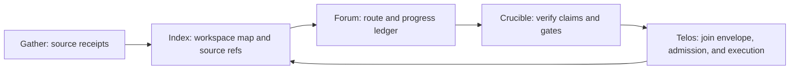

# Agent Context Envelopes

Fresh evidence checked on 2026-06-27.

Project Telos treats enterprise-codebase context as a packet with two layers:

- The model-visible layer is compact, readable, and ranked for the work at hand.
- The authority layer is exact: file ranges, content hashes, expansion commands, freshness checks, and receipt-chain records.

That distinction matters. Long-context models and context compaction are getting better, but more context is not automatically better. Current Anthropic guidance names context as finite working memory and warns that recall can degrade as context grows. Their long-running agent harness writeup also lands on the same operational pattern Telos needs: initialize the workspace, work incrementally, leave progress artifacts, test before marking work complete, and make the next session cheap to restart.

Prompt compression research is useful, but it is not a magic lossless channel. LLMLingua and LLMLingua-2 show strong compression results for many tasks, while newer evaluations continue to show that compression gains depend on task, model, hardware, and the kind of information being omitted. Telos therefore compresses for model attention while preserving exact replay through source anchors.

## Contract

The convention lives at [`demo/integrations/context-envelope-conventions.json`](../demo/integrations/context-envelope-conventions.json).

An envelope must include:

- `envelope_id`, workspace hash, git head, and dirty state.
- A context budget: maximum input, target packet size, and reserved response budget.
- A compression record: strategy, ratio target, and whether the packet is lossless by reference.
- Source refs: path, range, content hash, and an expansion command.
- Summary claims, each joined to one or more source refs.
- Receipt-chain records from Gather, Index, Forum, Crucible, and Telos where relevant.
- Quality gates for readability, tests, freshness, and admission.

Hidden payloads are not authoritative context. Steganography may be useful for watermarking rendered artifacts or carrying a non-authoritative pack identifier, but required operational context must be visible, typed, hash-addressed, and replayable.

## Flagship Flow

Index builds the workspace map and compact context pack. Gather attaches source and research receipts. Forum records agent lane, progress, and human-readable handoff. Crucible checks claims, tests, and readability gates. Telos joins the context envelope to admission telemetry, action receipts, and later execution spans. Action receipts carry input/material digests, component version, config hash, side-effect class, typed stop reason, policy decision, verification verdict, and append-only compensation pointers.

## Readability Gate

Agent-produced code should optimize for the next agent and the human reviewer. The gate is simple:

- Prefer small named helpers over dense inline logic.
- Preserve local style and public interfaces unless the receipt explains the change.
- Name intermediate values after domain concepts.
- Comment invariants, protocol boundaries, and non-obvious tradeoffs.
- Avoid clever token-saving code when it makes future work slower.

The target is unattended work that can be trusted because it leaves an inspectable trail: what the agent saw, what exact source it expanded, what it changed, what it verified, and what remains unverified.

## Host Shape

MCP already standardizes tool discovery, tool calls, and structured content. OpenAI Agents support hosted, Streamable HTTP, SSE, and stdio MCP integrations, while Claude Code supports local stdio, remote HTTP, plugin-provided MCP servers, dynamic tool updates, resources, and tool search. The context envelope is intentionally transport-neutral: it can be returned as CLI JSON, MCP structured content, an IDE panel payload, a TUI run record, or an application database row.

## Failure Codes

The envelope uses normalized failures so operators can query large unattended runs:

- `stale_context`: a referenced source hash moved.
- `lossy_summary`: a model-visible claim lacks source refs.
- `missing_source_ref`: a required source ref is absent.
- `unexpanded_required_ref`: an edit depends on a ref that was not expanded.
- `unjoinable_receipt`: a receipt cannot join to the action or envelope.
- `readability_regression`: the patch makes the code harder to maintain.
- `quality_gate_missing`: required test or review evidence is absent.
- `budget_exceeded`: the packet exceeds its declared token budget.

## Sources

- MCP base protocol and tools: <https://modelcontextprotocol.io/specification/2025-06-18/basic>, <https://modelcontextprotocol.io/specification/2025-06-18/server/tools>
- OpenAI Agents SDK MCP: <https://openai.github.io/openai-agents-python/mcp/>
- Claude Code MCP: <https://code.claude.com/docs/en/mcp>
- Claude context windows: <https://platform.claude.com/docs/en/build-with-claude/context-windows>
- Anthropic context engineering: <https://www.anthropic.com/engineering/effective-context-engineering-for-ai-agents>
- Anthropic long-running harnesses: <https://www.anthropic.com/engineering/effective-harnesses-for-long-running-agents>
- LLMLingua: <https://arxiv.org/abs/2310.05736>
- LLMLingua-2: <https://arxiv.org/abs/2403.12968>
- Prompt compression in the wild: <https://arxiv.org/abs/2604.02985>
