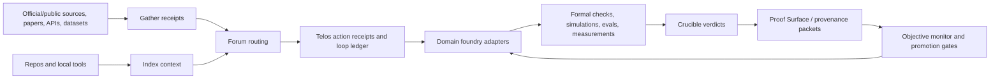

# World-Scale Fast-Track Recon

Date: 2026-07-01

Scope: Project Telos, BuildLang/buildc/Build Universe, Build Color, Calibrate Pro, and adjacent public tools in `C:/dev/public`.

## Executive Read

The fastest credible path is not to claim that Telos can already discover new laws of physics, solve clinical biology, or train frontier-lab-scale models. The fastest path is to build a **Frontier Proof OS**: a set of proof-carrying domain foundries that shrink the loop from claim -> source -> tool action -> simulation/formal check/measurement -> Crucible verdict -> reusable proof packet.

This fits the current system better than a monolithic "world solver." Index, Gather, Forum, Crucible, and Telos already provide the spine: structure intake, source intake, routing, verification pressure, action receipts, measurement layers, loop ledgers, objective monitoring, and operator-facing packets. BuildLang/buildc adds a receipt-bearing compiler substrate with typed effects and an experimental resource/no-cloning track. Build Color and Calibrate Pro add a rare visual/instrumentation truth layer for displays, color spaces, HDR, ICC/LUT profiles, and verification.

The market gap is also clear: existing tools are strong inside silos, but weak across boundaries. Formal proof systems do not naturally connect to research graphs, AI evals, compiler receipts, wet-lab metadata, quantum chemistry simulators, display calibration, and agent action ledgers. Telos can occupy the gap by becoming the cross-domain proof and orchestration layer.

## Verification State

Crucible packet:

- Thesis: `C:/dev/tmp/telos-world-scale-fast-track-thesis.json`
- Measurements: `C:/dev/tmp/telos-world-scale-fast-track-measurements.json`
- Clean report: `C:/dev/tmp/telos-world-scale-fast-track-crucible-report-v2.md`
- Run record: `C:/dev/tmp/telos-world-scale-fast-track-crucible-run-v2.json`
- Assessment: MATCH 9 / DRIFT 0 / UNVERIFIABLE 0
- Integrity: `seals_ok=True`, `thesis_ok=True`, `verdicts_rederive=True`

Note: an earlier exploratory Crucible run used zero tolerances and correctly returned UNVERIFIABLE because zero tolerance is treated as non-measurable. That is a useful product finding: Crucible should emit a sharper hint when a measurement file uses a zero tolerance.

## Current Local Capability Receipts

High confidence:

- Index mapped `C:/dev/public` as 65 repositories: 61 public-class, 4 local-class, dirty_count 2.
- Telos room reports MATCH, 5/5 tools ready, 20/20 checks passed, and 65 protocol tools.
- Forum routes this request as low-confidence escalation rather than a single lane.
- Telos exposes runnable local contracts for model-foundry, learning labs, research seeds, measurement layers, display calibration, action receipts, objective monitoring, browser evidence, native control, creative engine, rendering research, and second-level queue promotion.
- `demo/integrations/science-research-adapters.json` exists, but `demo/science-research-adapters.mjs` does not. That adapter layer is a blueprint, not an executable foundry yet.
- BuildLang documents typed effects, source digests, policy receipts, corpus/substrate/MIR/memory/symbol receipts, and an experimental `#[linear]` no-cloning track. Its README also states the linear track is not fully sound yet and needs an affine/borrow checker on MIR.
- Build Universe is alpha and mixed-language. Its README says self-hosting and whole-ecosystem cross-module compilation are goals, not achievements.
- Calibrate Pro and Build Color are relevant to the scientific tool surface because visual outputs, microscopy, graphics, UI inspection, training-data review, and scientific rendering all depend on trustworthy color/measurement context.

## Fast-Track Domain Ladder

| Priority | Domain | Why first | Existing leverage | First proof packet |
| --- | --- | --- | --- | --- |
| 1 | Formal math | No lab hardware; proofs are machine-checkable; high leverage for physics, compilers, security, and AI reasoning. | Lean, mathlib, LeanDojo; BuildLang receipts; Crucible verdicts. | Lean theorem task -> proof attempt -> checker receipt -> proof-surface packet. |
| 2 | AI/ML eval and model foundry | Directly improves every other domain by making model claims measurable. | Telos model-foundry, action receipts, objective monitor, model-provenance-validator; Inspect, MLCommons, NIST AI RMF. | One benchmark suite with tool-call, citation, reasoning, and objective-drift gates. |
| 3 | Research graph / open science | Turns scattered literature and APIs into replayable source packets. | Gather, science adapter JSON, OpenAlex, DataCite, arXiv, bioRxiv, NCBI, RCSB, AlphaFold. | Research claim -> source graph -> freshness/license/access packet -> Crucible status. |
| 4 | Quantum algorithms and quantum chemistry | Good open frameworks exist; useful even before fault-tolerant hardware. | Qiskit Nature, OpenFermion, PennyLane, CUDA-Q; BuildLang resource types later. | H2/LiH or Fermi-Hubbard benchmark -> circuit/simulator receipt -> energy/error packet. |
| 5 | Biology and structural bio | Open data is strong, but clinical claims must remain bounded. | NCBI Datasets, AlphaFold DB, RCSB PDB, bioRxiv, Europe PMC. | Protein/gene hypothesis packet with source, structure, confidence, and non-clinical boundary. |
| 6 | Physics and computational science | High ambition, but needs simulation discipline before discovery claims. | DOE ASCR/ECP/SciDAC ecosystem; BuildLang effects; signal-kernels; measurement layers. | Dimensional-analysis + simulation replay packet for one bounded physical model. |
| 7 | Earth/climate/societal decisions | Strong open data and obvious societal value; needs careful uncertainty. | NASA Earthdata, NOAA/NWS APIs, signal/anomaly kernels, objective monitor. | Forecast/alert/decision packet with data provenance and uncertainty budget. |
| 8 | Computing frontiers / semiconductor / OS | High long-term leverage but slower to prove. | BuildLang/buildc, Build Universe, gpu-trace-validator, anomaly/signal kernels. | Compiler effect receipt + benchmark + trace validation packet. |
| 9 | Visual truth / color calibration | Distinctive but underused market angle: measured perception and rendering trust. | Build Color, Calibrate Pro, telos.display.calibration, measurement layers. | Display/color proof packet: profile/LUT/Delta E/HDR/color-space evidence. |

## Megatool Assemblies

| Megatool | Combine | Market / infrastructure gap | First build |
| --- | --- | --- | --- |
| Frontier Proof OS | Gather + Index + Forum + Telos + Crucible + Proof Surface + model provenance + action receipts. | Cross-domain work lacks a shared proof spine across sources, models, code, data, measurements, and actions. | `telos proof <domain>` CLI that emits one packet shape for every domain. |
| Research Foundry | Gather + science adapters + OpenAlex/DataCite/arXiv/bioRxiv/NCBI/RCSB/AlphaFold + research graph store. | Literature tools rarely preserve claim status, freshness, access/license, and model-action lineage together. | Executable `science-research-adapters.mjs` plus SQLite/DuckDB source graph. |
| Formal Math Forge | Lean + mathlib + LeanDojo + SorryDB-style task intake + BuildLang receipts + Crucible. | Proof assistants and AI theorem provers are not connected to broader research/eval/provenance workflows. | Lean checker bridge with proof attempt receipts and negative fixtures. |
| Model Foundry / Eval Forge | Telos model-foundry + Inspect + MLCommons + NIST profile + model-provenance-validator + objective monitor. | AI evals are fragmented and often detached from product claims, tool actions, data provenance, and drift. | One local benchmark bundle with model, tool-call, citation, and reward-drift checks. |
| Quantum/Physics Simulation Foundry | Qiskit Nature + OpenFermion + PennyLane + CUDA-Q + BuildLang + signal-kernels + Crucible. | Quantum/physics tools produce outputs, but adoption needs evidence packets, error budgets, and replayable configs. | Small-molecule or lattice-model packet with simulator, seed, backend, and tolerance. |
| Bio Evidence Foundry | NCBI + AlphaFold + RCSB + bioRxiv/PMC + model provenance + Crucible. | Biology tooling lacks a clean boundary between hypothesis generation, preprint evidence, structure prediction, and clinical claims. | Non-clinical protein/gene hypothesis packet with confidence and source status. |
| Earth/Societal Decision Foundry | NASA/NOAA/NWS + signal-kernels + anomaly-kernels + objective monitor + proof-surface reports. | Public data portals do not automatically become defensible decision systems. | Climate/weather/alert packet with uncertainty and decision audit trail. |
| Visual Truth Foundry | Build Color + Calibrate Pro + telos.display.calibration + measurement layers + creative engine. | Model-generated visual work, scientific rendering, and inspection workflows often assume unmeasured displays and color transforms. | Read-only display/color packet; later gated hardware mutation with restore-state receipts. |
| Build Substrate Foundry | BuildLang/buildc + Build Universe + gpu-trace-validator + repo-proof-index + proof-surface. | Systems languages and compiler experiments rarely expose effect, backend, corpus, and benchmark claims as portable proof packets. | BuildLang effect/corpus receipt adapter into Telos proof packets. |

## Architecture Map

## Highest-Value Infrastructure Gaps

1. `science-research-adapters.json` is not executable. Build `demo/science-research-adapters.mjs`, tests, and a schema validator first.
2. Add a common domain adapter SDK. Every adapter should emit `source_ref`, `license/access`, `retrieved_at`, `freshness`, `claim_status`, `domain`, `risk_boundary`, and `promotion_requirements`.
3. Add a local research graph store. Use SQLite or DuckDB for works, authors, datasets, proteins, structures, trials, tasks, proofs, models, and packets.
4. Add a claim ladder shared across domains: `lead`, `source-backed`, `reproduced`, `benchmarked`, `formalized`, `measured`, `reviewed`, `deployed`.
5. Add a `telos proof` CLI that builds proof packets from adapters, local commands, and Crucible results.
6. Add a Lean bridge. Store theorem tasks, run the checker, emit proof attempt receipts, and mark failed proof attempts as useful evidence.
7. Add an Inspect/MLCommons bridge for model/tool/citation/agentic evals.
8. Add quantum bridges for Qiskit Nature, OpenFermion, PennyLane, and CUDA-Q with tiny benchmark fixtures.
9. Add biology bridges for NCBI, AlphaFold DB, RCSB PDB, bioRxiv, PubMed/PMC, and Europe PMC.
10. Add Earth data bridges for NASA Earthdata, NASA APIs, NOAA CDO, and NWS API.
11. Add compute-budget receipts: local CPU/GPU, cloud GPU, remote API, HPC proposal, energy/time/cost, and reproducibility constraints.
12. Harden BuildLang's linear/resource story before using it for quantum correctness claims: MIR affine/borrow checker, resource negative fixtures, and proof-packet export.
13. Keep Build Universe claims honest: market it as an alpha module/spec corpus until whole-ecosystem compilation and self-hosting are real.
14. Promote Build Color and Calibrate Pro as measurement tools, not decoration. Tie visual claims to display/profile/LUT/Delta E/HDR receipts.
15. Improve Crucible measurement UX: zero tolerance should produce a specific validation warning before assessment.

## Market Gaps To Attack

| Gap | Existing market shape | Telos angle |
| --- | --- | --- |
| Cross-domain proof packets | Scientific notebooks, dashboards, model cards, CI logs, proof assistants, and data portals live separately. | One portable claim/action/source/measurement packet shape. |
| AI eval connected to real work | Inspect/MLCommons/NIST help, but product workflows still lose provenance and action binding. | Model foundry with action receipts, context packs, model provenance, and objective drift gates. |
| Research intake with claim status | Literature managers and search APIs collect references, not trustworthy claim states. | Gather-backed research graph with freshness, license/access, and UNVERIFIABLE status as first-class. |
| Formal math in applied research | Lean/mathlib are powerful but sit apart from simulation, source graphs, and agent workflows. | Formal Math Forge that turns selected domain claims into proof tasks and receipts. |
| Quantum/physics reproducibility | Quantum frameworks provide circuits/simulators, but not always operator-friendly proof packets. | Quantum Simulation Foundry with backend, seed, circuit, observable, error, and tolerance receipts. |
| Biology hypothesis boundaries | AI biology tooling can blur preprint, prediction, experiment, and clinical recommendation. | Bio Evidence Foundry with explicit non-clinical status and promotion requirements. |
| Visual calibration in AI workflows | Color tools live outside AI/data/science proof systems. | Visual Truth Foundry for calibrated display/color/rendering evidence. |
| Compiler/runtime accountability | Build tools rarely package effect, policy, source digest, backend maturity, and benchmark together. | Build Substrate Foundry with BuildLang/buildc receipts feeding Telos proof packets. |

## 90-Day Fast Track

Days 1-10:

- Build `science-research-adapters.mjs`.
- Define `project-telos.domain-adapter/v1`.
- Define `project-telos.proof-packet/v1`.
- Add tests for OpenAlex, DataCite, NCBI, AlphaFold, RCSB, Qiskit Nature, and Lean stub packets.
- Add a Crucible validation rule for zero-tolerance measurement config.

Days 11-30:

- Ship Research Foundry MVP: source graph, search, claim ladder, freshness/access/license status.
- Ship Model Eval Forge MVP: Inspect-compatible task packet, MLCommons/NIST references, model-provenance envelope, objective monitor.
- Ship BuildLang proof adapter: `buildc check --receipt` -> Telos proof packet.

Days 31-60:

- Ship Formal Math Forge MVP with Lean checker receipts.
- Ship Quantum/Physics Simulation Foundry MVP with one quantum chemistry or lattice benchmark.
- Ship Visual Truth Foundry MVP with Build Color + Calibrate Pro read-only packet export.

Days 61-90:

- Ship Bio Evidence Foundry MVP: NCBI + AlphaFold + RCSB non-clinical hypothesis packets.
- Ship Earth/Societal Decision Foundry MVP: NASA/NOAA/NWS source packet plus uncertainty budget.
- Publish a three-packet showcase: theorem proof packet, quantum simulation packet, biology structure packet.
- Add partner-ready packets for NSF TIP, DOE ASCR, ARPA-H, DARPA, and lab/academic collaborators.

## What Not To Do

- Do not lead with "we can solve new laws of physics" as a product claim. Lead with proof-carrying loops that make physics work more reproducible.
- Do not build a giant UI before the adapter and packet contracts exist.
- Do not claim clinical biology or medical decision support. Keep biology packets non-clinical until external validation, governance, and regulatory review exist.
- Do not make BuildLang quantum/resource claims depend on the current experimental linear track alone.
- Do not mutate display hardware through Telos until read-only packets, restore-state receipts, and local safety gates are mature.
- Do not train large-scale models before the data/eval/provenance engine is defensible. Start with routing, evals, post-training, small models, and proof packets.

## External Sources Used

- National Quantum Initiative: https://www.quantum.gov/
- DOE Advanced Scientific Computing Research: https://www.energy.gov/science/ascr/advanced-scientific-computing-research
- ARPA-H programs: https://arpa-h.gov/explore-funding/programs
- NIH BRAIN Initiative: https://www.nih.gov/brain
- Lean: https://lean-lang.org/
- LeanDojo: https://leandojo.org/leandojo.html
- Inspect AI eval framework: https://inspect.aisi.org.uk/
- MLCommons AI Risk & Reliability: https://mlcommons.org/working-groups/ai-risk-reliability/ai-risk-reliability/
- NIST AI RMF: https://www.nist.gov/itl/ai-risk-management-framework
- OpenAlex API: https://developers.openalex.org/api-reference/introduction
- DataCite API: https://support.datacite.org/docs/api
- NCBI Datasets REST API: https://www.ncbi.nlm.nih.gov/datasets/docs/v2/api/rest-api/
- AlphaFold DB: https://alphafold.ebi.ac.uk/
- RCSB PDB Data API: https://data.rcsb.org/
- Qiskit Nature: https://qiskit-community.github.io/qiskit-nature/
- OpenFermion: https://quantumai.google/openfermion
- PennyLane: https://github.com/PennyLaneAI/pennylane
- CUDA-Q: https://nvidia.github.io/cuda-quantum/latest/index.html

## Local Sources Used

- `C:/dev/public/telos/README.md`
- `C:/dev/public/telos/docs/ARCHITECTURE.md`
- `C:/dev/public/telos/demo/integrations/science-research-adapters.json`
- `C:/dev/public/telos/demo/integrations/second-level-flagship-queue.json`
- `C:/dev/public/pubscan/quantalang/README.md`
- `C:/dev/public/build-universe/README.md`
- `C:/dev/public/build-color/README.md`
- `C:/dev/public/calibrate-pro/README.md`
- `C:/dev/public/signal-kernels/README.md`
- `C:/dev/public/anomaly-kernels/README.md`
- `C:/dev/public/proof-surface/README.md`
- `C:/dev/public/model-provenance-validator/README.md`
- `C:/dev/public/provenance-sensorium/README.md`

## Bottom Line

The highest-leverage move is to make Telos the system that proves work, not the system that merely says big things. Build the foundries in this order: research graph, formal math, AI eval, quantum/physics simulation, bio evidence, Earth decision support, visual truth, and compiler substrate. The megatool is the shared proof spine that lets each foundry reuse sources, actions, measurements, formal checks, model evals, and promotion gates instead of rebuilding trust from scratch.
