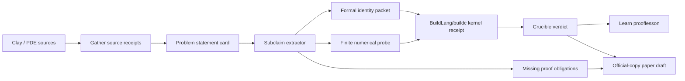

# Eleventh-Wave Grand-Problem Isolation

Date: 2026-07-02

Status: source-led narrowing packet

Evidence boundary: public program anchors, Gather arXiv metadata, a local source-router demotion gate, Forum/Index route checks, and current Telos tool-shape receipts. This packet does not claim a grand challenge is solved, does not claim theorem replay, does not claim experimental validation, and does not claim latest or exhaustive literature coverage.

## Decision

Primary grand target for the next focused phase: **Navier-Stokes existence and smoothness**.

Reason: it is a true Millennium Prize problem, it sits at the intersection of mathematics, physics, numerical simulation, rendering/fluids, climate/weather, aerospace, energy, and high-performance computing, and it gives Project Telos a clean way to publish something of merit before any grand theorem is solved:

> A proof-carrying PDE research packet that separates formal identities, numerical probes, compiler/runtime receipts, uncertainty budgets, and missing proof obligations.

The first publishable target is not "Project Telos solved Navier-Stokes." The first publishable target is:

> Proof-carrying Navier-Stokes subclaims: a source-bound, reproducible, verifier-gated packet for energy identities, finite-dimensional Galerkin toy systems, and numerical/BuildLang kernel receipts that preserve the gap between certified subclaims and the Millennium problem.

## Why This Target

| Criterion | Navier-Stokes | P vs NP | Yang-Mills mass gap | Biology/medicine | Robotics/autonomy |
| --- | --- | --- | --- | --- | --- |
| True grand-problem status | Clay Millennium problem, official unsolved page. | Clay Millennium problem, official unsolved page. | Clay Millennium problem. | Societal grand challenge, but problem statements are plural and evidence standards vary. | Societal and defense grand challenge, but not one theorem. |
| Fit to BuildLang/buildc | Strong: PDE kernels, spectral methods, typed numeric receipts, deterministic compiler evidence. | Moderate: SAT/certificate checkers and proof complexity experiments. | Strong but higher theory and physics barrier. | Strong for modeling, but clinical/wet-lab boundaries slow publication. | Strong for simulation and action receipts, but hardware transfer slows claims. |
| Fit to Telos proof packets | Strong: source, theorem statement, assumptions, numerical probe, verifier verdict, boundary. | Strong for certificate/proof assistant lanes. | Strong but difficult to make first packet legible. | Strong for claim provenance, weaker for fast truth promotion. | Strong for simulator/action receipts, weaker for physical claims. |
| First publishable subclaim | Energy identity and Galerkin toy packet with strict boundary. | SAT certificate and failed-proof boundary packet. | Lattice toy packet and continuum-boundary note. | Source-to-causal-claim packet. | Sim-to-real failure taxonomy packet. |
| Overclaim risk | Manageable if every result is scoped as subclaim, identity, or numerical probe. | High because readers may infer "P vs NP attack." | High because simulations are easy to over-promote. | Very high because health claims can imply patient relevance. | High because simulator results can imply physical safety. |
| Strategic upside | Connects proof, scientific compute, BuildLang, rendering/fluids, climate, HPC, and education. | Connects proof and security. | Connects quantum field theory and scientific compute. | Massive health value, but needs domain partnerships. | Massive deployment value, but needs hardware loop. |

Decision state: `HYPOTHESIS_SELECTED`, not proof.

## Public Anchors

These anchors justify the target and market/institutional relevance. They are not evidence for our scientific claims.

| Anchor | What it supports | Packet implication |
| --- | --- | --- |
| Clay Mathematics Institute Millennium Prize Problems, `https://www.claymath.org/millennium-problems/` | Clay lists Navier-Stokes, P vs NP, Riemann, Yang-Mills, and other problems as the canonical prize-problem set. | Use Clay pages as problem-statement anchors, not proof sources. |
| Clay Navier-Stokes page, `https://www.claymath.org/millennium/navier-stokes-equation/` | Clay marks Navier-Stokes as unsolved and frames existence/uniqueness as basic unresolved proof questions. | The grand claim remains `UNVERIFIABLE` unless a domain-grade proof exists. |
| DOE ASCR, `https://www.energy.gov/science/ascr/advanced-scientific-computing-research` | DOE ASCR frames HPC, AI, modeling, simulation, climate, energy, materials, fusion, and human health as connected scientific-computing priorities. | BuildLang/buildc and Telos should target proof-carrying scientific compute, not just prose research notes. |
| NASA/ESA Earth observation foundation-model workshop, `https://www.earthdata.nasa.gov/events/second-esa-nasa-international-workshop-ai-foundation-models-earth-observation` | The workshop emphasizes scientific rigor, reproducibility, benchmarking, and operational constraints for climate/Earth FMs. | Climate-adjacent outputs need data/model/version/uncertainty receipts. |
| NIH Common Fund current programs, `https://commonfund.nih.gov/current-programs` | NIH Common Fund funds broad cross-institute discovery programs including Bridge2AI, PRIMED-AI, replication, HuBMAP, and precision-health work. | Bio/medicine lanes remain source-federation and causal-claim packets until domain-grade evidence exists. |
| DARPA RACER finish-line article, `https://www.darpa.mil/news/2026/racer-finish-line` | DARPA describes robust off-road autonomy stacks and aggressive field testing. | Robotics claims need simulator/physical split and action receipts. |
| DARPA physical-intelligence RFI article, `https://www.darpa.mil/news/2026/rethinking-robotics` | DARPA highlights materials, sensing, actuation, and embedded compute as robotics bottlenecks. | BuildLang/color/materials/control tooling can serve physical-intelligence measurement packets. |
| AI Cyber Challenge, `https://aicyberchallenge.com/` | AIxCC frames AI cyber systems around securing critical software and publishes open-source CRS outputs. | Cyber lanes should use defensible defensive benchmarks and patch receipts only. |
| Climate Change AI, `https://www.climatechange.ai/` | CCAI maintains reports, data-gap work, events, and community infrastructure around ML for climate. | Climate proof packets should treat public claims, datasets, and uncertainty as first-class objects. |

## Source Intake

Gather source intake for this pass captured 71 routed rows across 13 lanes. These are source leads only.

| Lane | Store | Retained rows | Dropped rows | Seal | State |
| --- | --- | ---: | ---: | --- | --- |
| Formal proof frontier | `docs/outreach/receipts/eleventh-wave/arxiv-formal-proof-frontier` | 7 | 1 | `d03a5ce81ecebfb893117277eaad46b6cd487cb6558709faa2993ccd93af7e5c` | `SOURCE_LEAD` |
| Quantum frontier | `docs/outreach/receipts/eleventh-wave/arxiv-quantum-frontier` | 8 | 0 | `eb6283370103682ce1e902bc8d3bcbe64fc3aef6e134b949e1cd83c584a498ae` | `SOURCE_LEAD` |
| Fusion and plasma | `docs/outreach/receipts/eleventh-wave/arxiv-fusion-plasma` | 6 | 2 | `d8858967e8c9e8a0981622d8cf7a02e95fa33eb1ac90ab22101f52e966703078` | `SOURCE_LEAD` |
| Climate frontier | `docs/outreach/receipts/eleventh-wave/arxiv-climate-frontier` | 7 | 1 | `3274416a2aa9aaf9c38ca5e3a1bfa73ca0ae894249a9b87277498d2324cf507e` | `SOURCE_LEAD` |
| Materials frontier | `docs/outreach/receipts/eleventh-wave/arxiv-materials-frontier` | 8 | 0 | `4bb1db22b8c92aa00eade041409b02d0adbfed0d6546e95e0e5dd0161c306204` | `SOURCE_LEAD` |
| Biology frontier | `docs/outreach/receipts/eleventh-wave/arxiv-biology-frontier` | 6 | 2 | `457eab5aa05c7b1c2c3a13378bb8b78fe8721ed663c9a87395d88a55b8ff8eca` | `SOURCE_LEAD` |
| Medicine frontier | `docs/outreach/receipts/eleventh-wave/arxiv-medicine-frontier` | 5 | 3 | `8d7c926ca825b9941cea455af356f177856ebb68d60e376681983b7306dbaa17` | `SOURCE_LEAD` |
| Robotics frontier | `docs/outreach/receipts/eleventh-wave/arxiv-robotics-frontier` | 8 | 0 | `8d954f470435bbbd0b9e487016088e1845ddaa4d2923389b1a494890aa6d67c5` | `SOURCE_LEAD` |
| Cyber frontier | `docs/outreach/receipts/eleventh-wave/arxiv-cyber-frontier` | 3 | 5 | `048c25066c89a31e81371340bf25e8db66620cdd8ca28c14282c1ae042091111` | `SOURCE_LEAD` |
| Finance frontier | `docs/outreach/receipts/eleventh-wave/arxiv-finance-frontier` | 3 | 5 | `c708632b66cb23ff8b08d136314d540c19fcaca2320403b948f844c4b99ecf2b` | `SOURCE_LEAD` |
| Number theory formalization | `docs/outreach/receipts/eleventh-wave/arxiv-number-theory-formalization` | 4 | 4 | `367bd21c7625d4dcdb9e49f51bdc87df1704890a00d2ac6144219e9318a32c02` | `SOURCE_LEAD` |
| PDE frontier | `docs/outreach/receipts/eleventh-wave/arxiv-pde-frontier` | 5 | 3 | `da0e9d9062c51886bca512eb3d666b53c01652740c49bfe50997d9d32b77d13f` | `SOURCE_LEAD` |
| Theoretical CS frontier | `docs/outreach/receipts/eleventh-wave/arxiv-theoretical-cs-frontier` | 0 | 8 | `4f53cda18c2baa0c0354bb5f9a3ecbe5ed12ab4d8e11ba873c2f11161202b945` | `NEGATIVE_SEARCH_RECEIPT` |

Demotion gate: `docs/outreach/receipts/eleventh-wave/hard-problem-source-router-demotion-gate.json`

Gate summary:

- 71 rows across 13 lanes.
- 67 unique arXiv IDs.
- 66 `domain_lead` rows.
- 3 `adjacent_lead` rows.
- 1 `query_noise` row.
- 1 `zero_retained_rows` negative search receipt.
- Duplicate IDs: `2604.16507v1`, `2404.12534v3`, and `2604.05238v1`, all shared by formal-proof and number-theory-formalization lanes.

## Primary Proof Program

Name: `navier-stokes-proof-packet-program`

Grand problem state: `UNVERIFIABLE`

First publishable claim family:

| Subclaim | Evidence type | Tool path | Promotion target |
| --- | --- | --- | --- |
| Incompressible periodic Navier-Stokes energy identity under stated smoothness assumptions. | Formal derivation plus executable symbolic/numeric check. | Gather source refs, BuildLang/buildc kernel receipt, Crucible measurement, Learn prooflesson. | `IDENTITY` or `CRUCIBLE_MATCH` for the bounded identity only. |
| Finite-dimensional Galerkin truncation preserves a stated energy relation under explicit basis and projection assumptions. | Reproducible toy model, seed, equations, run receipt. | BuildLang kernel plus JS/Python reference check until BuildLang library is mature. | `PROBE_MATCH` for finite model only. |
| Numerical blow-up probes remain non-proof unless tied to certified bounds. | Negative boundary packet. | Crucible should mark theorem claims `UNVERIFIABLE` unless proof obligations exist. | `UNVERIFIABLE` for grand theorem. |
| Source-to-proof mapping for Clay statement and Fefferman problem description. | Source-bound statement card. | Gather source capture, Index packet, Forum route, proof obligation list. | `SOURCE_BOUND_STATEMENT` only. |

## First Executable Packet

Packet path: `docs/research/proof-packets/navier-stokes-periodic-energy-identity-v0/`

This pass added the first bounded subclaim packet:

| Artifact | Role |
| --- | --- |
| `problem.statement.json` | Source-bound parent problem and bounded subclaim statement. |
| `subclaim.energy_identity.md` | Human-readable derivation and negative boundaries. |
| `kernel.reference.mjs` | Deterministic reference kernel for the periodic Taylor-Green energy identity. |
| `run.receipt.json` | Generated executable receipt. |
| `crucible-thesis.json` and `crucible-measurements.json` | Bounded claims and measurements. |
| `crucible-run.json` and `crucible-report.md` | Crucible assessment for the bounded identity and boundary. |

Run result:

- `bounded_identity_probe`: `MATCH`
- `parent_millennium_problem`: `UNVERIFIABLE`
- `residual_numeric_abs`: about `7.46e-14`
- `max_divergence_abs`: `0`
- Crucible packet result: 3 `MATCH`, 0 `DRIFT`, 0 `UNVERIFIABLE`
- Crucible assessment seal: `c65b234f56f85720c1dc322c7c15f44bdc782f48ab0541f7e815d2e89e06ed06`

Interpretation: this is a real bounded proof-packet seed. It can support a scoped identity/probe claim for one smooth periodic field. It does not support a Navier-Stokes Millennium claim.

## Architecture

## Thirty-Day Refinement Plan

| Week | Output | Acceptance gate |
| --- | --- | --- |
| 1 | Source-bound Navier-Stokes statement card and proof-obligation map. | Clay source refs captured; all claims labeled `SOURCE_LEAD`, `HYPOTHESIS`, `IDENTITY`, or `UNVERIFIABLE`. |
| 1 | Minimal finite-dimensional incompressible flow toy model. | Deterministic command emits seed, equations, assumptions, output hash, and failure case. |
| 2 | Energy-identity derivation packet. | Symbolic derivation or proof-assistant stub is explicit about assumptions and missing formalization. |
| 2 | BuildLang/buildc numeric kernel receipt. | BuildLang compiles/runs the toy check or a blocked receipt names the compiler/runtime gap. |
| 3 | Crucible assessment and negative theorem fixture. | Bounded subclaim can match; grand theorem claim must remain `UNVERIFIABLE`. |
| 3 | Learn prooflesson. | Reverify returns `VERIFIED` while preserving the scientific boundary. |
| 4 | Publishable working-paper draft and website-copy draft. | Paper states a real contribution: a proof-carrying PDE packet architecture plus one bounded verified subclaim or a precise blocked result. |

## What Would Count As Merit

The next publishable artifact has merit if it does at least one of these:

- Proves a bounded PDE identity with a replayable formal or executable witness.
- Shows a compiler/runtime receipt for a scientific kernel whose assumptions are tied to a proof packet.
- Demonstrates that Crucible rejects a grand-theorem overclaim while accepting a bounded subclaim.
- Provides a reusable schema for turning PDE research claims into source-bound proof obligations, runnable experiments, negative fixtures, and publication copy.
- Makes failure useful by recording exactly which formal proof, interval bound, theorem-prover environment, or numerical certification is missing.

## Do Not Claim

- Do not claim Telos solved Navier-Stokes.
- Do not claim a Galerkin toy model proves global regularity.
- Do not claim numerical evidence is a theorem.
- Do not claim BuildLang/buildc is a finished replacement for every scientific-computing stack.
- Do not claim arXiv metadata proves paper truth.
- Do not claim the eleventh-wave pass is latest or exhaustive.
- Do not claim a publishable artifact is an official accepted paper until it has actually been submitted and accepted.
