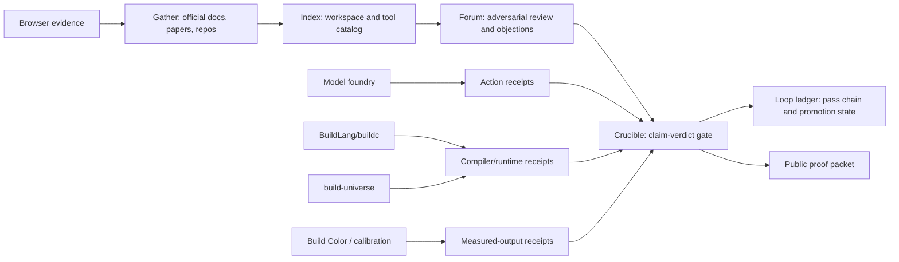

# Quantum Workflow Provenance Market Packet

Pass: `0020`

Date: 2026-07-01

Status: `MARKET_IMPORT_AUDIT_MATCH`

This packet maps the near-term quantum workflow and provenance market around a
specific Telos wedge: portable scientific proof packets that bind source intake,
workspace context, circuit/program representation, framework/runtime state,
provider metadata, result canonicalization, verifier verdicts, and agent/tool
action receipts.

All uniqueness claims remain hypotheses. This pass does not claim that no
competitor can provide these features. It records that each compared product
appears to cover part of the path, while the Telos hypothesis is that the
receipt object becomes more valuable when those layers are bound together.

## Generated Receipt

Artifact:

```text
schemas/quantum-workflow-market-import-audit-pass-0020.json
```

Seal:

```text
1c3263fe19f05d45e4f719f96c02703ca4e1f2739ecf8b85d03449ee49665eaf
```

Validator:

```text
schema = Pass0020QuantumWorkflowMarketValidatorRun/v1
status = MATCH
market_row_count = 22
wedge_score_count = 4
audit_row_count = 15
megatool_node_count = 12
source_anchor_count = 26
```

## Market Rows

The generated matrix covers 22 tools:

| Category | Tool |
| --- | --- |
| Quantum cloud runtime | IBM Qiskit Runtime |
| Quantum cloud runtime | Amazon Braket |
| Quantum cloud runtime | Azure Quantum |
| Quantum programming framework | Cirq / Google Quantum AI |
| Quantum programming and QML | PennyLane |
| Quantum programming and HPC | NVIDIA CUDA-Q |
| Quantum platform | Quantinuum Nexus |
| Quantum cloud and annealing | D-Wave Leap |
| Workflow orchestration | Covalent |
| Quantum software engineering | Classiq |
| Neutral-atom quantum programming | Pasqal Pulser |
| Quantum intermediate representation | QIR Alliance / QIR |
| Quantum compiler toolkit | TKET / pytket |
| Quantum circuit language | OpenQASM |
| ML experiment tracking | MLflow Tracking |
| ML experiment tracking | Weights & Biases Artifacts |
| Data and pipeline versioning | DVC |
| Observability | OpenTelemetry |
| Workflow orchestration | Prefect |
| Workflow orchestration | Flyte |
| Scientific workflow orchestration | Nextflow |
| Scientific workflow orchestration | Snakemake |

Each row includes buyer, category, official positioning, capabilities, sources,
gap label, confidence, and a hard uniqueness policy:

```text
HYPOTHESIS_ONLY_UNLESS_MATRIX_PROVES_EXCLUSION
```

## Gap Hypothesis

The repeated gap is not that the incumbents are weak. The stronger hypothesis is
that quantum providers, workflow orchestrators, ML experiment trackers, and
observability tools optimize different layers:

- quantum tools run or compile quantum programs;
- workflow tools orchestrate DAGs and tasks;
- experiment trackers capture parameters, metrics, artifacts, and lineage;
- observability tools capture traces, metrics, and logs;
- Telos can compete by producing a portable claim-to-receipt packet across all
  of those layers.

For this pass every gap is marked `inferred`, not `verified`, because proving
absence requires deeper product-by-product evaluation.

## Local Import Audit

The audit used `importlib.util.find_spec` and `importlib.metadata.version`.
It did not import the modules.

| Distribution | Module | Status |
| --- | --- | --- |
| `qiskit` | `qiskit` | `NOT_INSTALLED` |
| `qiskit-ibm-runtime` | `qiskit_ibm_runtime` | `NOT_INSTALLED` |
| `amazon-braket-sdk` | `braket` | `NOT_INSTALLED` |
| `cirq` | `cirq` | `NOT_INSTALLED` |
| `pennylane` | `pennylane` | `NOT_INSTALLED` |
| `pyqir` | `pyqir` | `NOT_INSTALLED` |
| `pytket` | `pytket` | `NOT_INSTALLED` |
| `cudaq` | `cudaq` | `NOT_INSTALLED` |
| `qnexus` | `qnexus` | `NOT_INSTALLED` |
| `pulser` | `pulser` | `NOT_INSTALLED` |
| `covalent` | `covalent` | `NOT_INSTALLED` |
| `mlflow` | `mlflow` | `NOT_INSTALLED` |
| `wandb` | `wandb` | `NOT_INSTALLED` |
| `dvc` | `dvc` | `NOT_INSTALLED` |
| `opentelemetry-api` | `opentelemetry` | `FOUND`, version `1.41.0` |

The only locally available audited package is `opentelemetry-api`. It is marked
`AVAILABLE_FOR_OTEL_BRIDGE_ONLY`, not a quantum framework integration.

## Wedge Ranking

| Rank | Wedge | Reason |
| --- | --- | --- |
| 1 | Scientific workflow provenance bridge with quantum as public proof domain | Highest urgency/demo readiness because synthetic adapters already exist and the receipt object can generalize to BuildLang/color/runtime proof kits. |
| 2 | Cross-provider quantum result canonicalization | Strong demo readiness and differentiation; good path from pass 0012-0019 artifacts into framework-import fixtures. |
| 3 | Quantum workflow proof packets | Strong market story, but buyer urgency needs interviews and packaging tests. |
| 4 | BuildLang accountable scientific runtime | Highest strategic upside, but needs executable BuildLang/buildc receipts to move beyond architecture. |

These scores are working hypotheses, not market proof.

## Megatool Integration Shape



The product family should not be a monolith. It should expose several
market-facing packets over a shared receipt substrate:

- research proof packets;
- agent action proof packets;
- quantum workflow proof packets;
- BuildLang scientific runtime receipts;
- color/rendering measurement proof kits;
- browser/source evidence packets;
- model-run provenance receipts.

## Promotion Ladder

| State | Entry Criteria | Exit Criteria |
| --- | --- | --- |
| `SYNTHETIC_ADAPTER_FIXTURE` | Adapter runs over synthetic provider-shaped output and hashes raw plus normalized results. | Local framework package is available and fixture can use a real framework object without cloud execution. |
| `FRAMEWORK_IMPORT_FIXTURE` | Package availability receipt is `FOUND` and fixture imports the framework under pinned environment receipt. | Provider/cloud credentials and read-only safety boundary are established with content-addressed result retrieval. |
| `LIVE_PROVIDER_FIXTURE` | Real provider result is captured with job id, backend, calibration/version references, shots, timestamps, result hash, and verifier verdict. | Independent reproduction or second backend/provider comparison is captured. |
| `PUBLIC_PROOF_DEMO` | Packet contains source, code, environment, compiler/runtime, provider, result, verifier, and negative-fixture receipts. | Buyer-facing demo can be rerun without secrets and without unsupported scientific claims. |

## Thirty-Day Push

Primary motion:

```text
Ship a rerunnable Bell/no-cloning quantum proof packet demo using synthetic
adapters first, add pinned framework imports second, and use the same packet
shape for BuildLang/color/runtime receipts.
```

Concrete work:

1. Create a pinned `quantum-proof-demo` environment with Qiskit, Cirq,
   PennyLane, Braket SDK, and pyqir import fixtures.
2. Add framework-import fixtures that use real local framework result objects
   but no cloud credentials.
3. Bind those fixtures into the existing strict JSON, numeric precision, object
   storage, and provider metadata receipts from passes 0015-0019.
4. Add a BuildLang/buildc companion demo with deterministic numeric output and
   compiler/runtime receipt fields.
5. Publish the demo as a proof packet, not as a claim of quantum advantage or
   scientific discovery.

## Source Anchors

The structured schema includes 26 source anchors, including IBM Quantum, Amazon
Braket, Azure Quantum, Cirq, PennyLane, CUDA-Q, Quantinuum Nexus, D-Wave,
Covalent, Classiq, Pulser, QIR, TKET, OpenQASM, MLflow, W&B, DVC,
OpenTelemetry, Prefect, Flyte, Nextflow, and Snakemake.

## Non-Promotion

No quantum framework was imported in this pass. No cloud provider job was run.
No quantum hardware result, theorem, natural law, material result, biological
result, medical result, finance result, or safety result is promoted.
